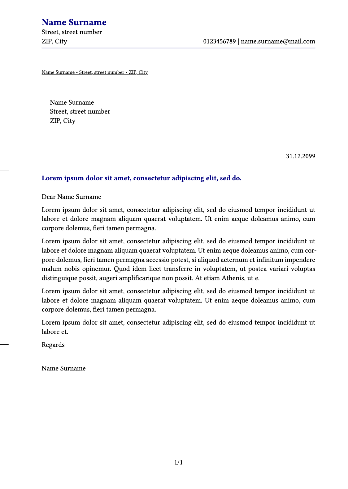

# Description

A [typst](https://typst.app) template for a [DIN 5008](https://de.wikipedia.org/wiki/DIN_5008) inspired letter with the goal to fit nicely into C6/5 envelops.

# Contributing

I have yet to use the template in practice. Feel free open issues and pull requests.
